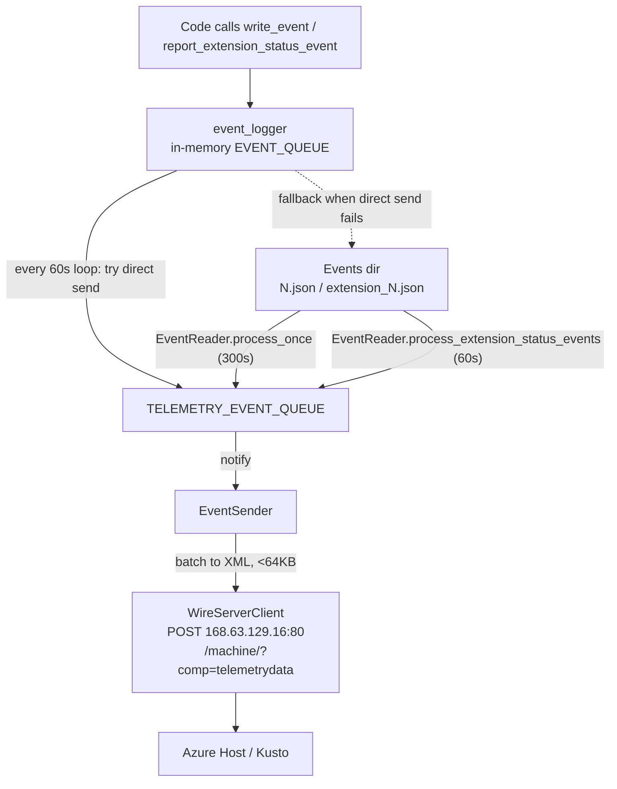

# Telemetry Event Flow

This document describes how telemetry events are produced, buffered, read, and
sent out of the VM by the GuestProxyAgent.

The telemetry system lives in `proxy_agent_shared/src/telemetry/` and is a
**producer → disk buffer → reader → queue → wire-server** pipeline composed of
four cooperating async tasks. All four are spawned in
[provision.rs](../proxy_agent/src/provision.rs).

## End-to-end flow

## Stage 1 — Production (in-memory)

File: `proxy_agent_shared/src/telemetry/event_logger.rs`

- Application code calls `write_event` / `write_event_only` (generic logs) or
  `report_extension_status_event` (extension status).
- Generic events are always pushed into a bounded in-memory `EVENT_QUEUE`
  (capacity 1000). Messages are truncated to 4 KB (`MAX_MESSAGE_LENGTH`).
- A background loop wakes **every 60 seconds** and drains the queue. For each
  event it first tries the **direct in-memory send path** — converting the
  event and pushing it straight into the `EventSender`'s `TELEMETRY_EVENT_QUEUE`
  (then waking the sender). Only events that cannot be enqueued directly fall
  back to disk.

## Stage 2 — Disk buffer (fallback only)

- The on-disk buffer is now a **fallback**, used only when the direct send path
  is disabled or the in-memory send queue is full/closed. This lets VMs without
  disk write permission still report telemetry over the direct path.
- The direct path is enabled by `event_sender::enable_direct_send(...)`, called
  once from the proxy agent service (the process that runs the `EventSender`).
  In processes that do not run an `EventSender` (e.g. the extension), the direct
  path stays disabled and everything falls back to disk as before.
- Two file types act as the durable fallback buffer:
  - Generic logs: `^[0-9]+\.json$` → `TelemetryGenericLogsEvent`
  - Extension status: `^extension_[0-9]+\.json$` → `TelemetryExtensionEventsEvent`
- If the direct write succeeds, the disk is never touched. If it falls back, the
  file-count cap (`max_event_file_count`) still applies as backpressure.

## Stage 3 — Reading & enqueueing

File: `proxy_agent_shared/src/telemetry/event_reader.rs`

Two independent reader loops:

- `start` → `process_once` runs **every 300s**: reads generic `*.json` files,
  converts each to a `TelemetryEvent::GenericLogsEvent`, enqueues into
  `TELEMETRY_EVENT_QUEUE`, then **deletes the file**.
- `start_extension_status_event_processor` → `process_extension_status_events`
  runs **every 60s**: same for `extension_*.json` →
  `TelemetryEvent::ExtensionEvent`.
- Optional `EventReaderLimits` enforce max events/round and max file size;
  oversized files are deleted to avoid blocking.
- After enqueueing, each calls `common_state.notify_telemetry_event()` to wake
  the sender.

## Stage 4 — Sending out of the VM

File: `proxy_agent_shared/src/telemetry/event_sender.rs`

- `EventSender::start` waits on a `notify` (or cancellation). On notify it calls
  `process_event_queue`:
  1. Refreshes VM metadata via `WireServerClient` + `ImdsClient`.
  2. Builds `TelemetryEventVMData` (tenant, role, subscription, VM id, OS, RAM,
     CPU…).
  3. `send_events` batches queued events into `TelemetryData`, capping each
     payload at **64 KB** (`MAX_MESSAGE_SIZE`); oversized single events are
     dropped, otherwise re-enqueued.
  4. Serializes to the Azure telemetry XML format
     (`telemetry_event.rs`) with provider IDs:
     - Generic logs: `FFF0196F-EE4C-4EAF-9AA5-776F622DEB4F`
     - Extension status: `69B669B9-4AF8-4C50-BDC4-6006FA76E975`

## The actual exit point

File: `proxy_agent_shared/src/host_clients/wire_server_client.rs`

- `send_telemetry_data` POSTs the XML to the **Azure WireServer at
  `168.63.129.16:80`**, path `/machine/?comp=telemetrydata`, headers
  `x-ms-version: 2012-11-30` and `Content-Type: text/xml`.
- The sender retries up to **5 times with 15s backoff** on failure. This is the
  single egress path; from there the Azure host platform forwards events to its
  telemetry backend.

## Key design points

- **Durability:** events survive on disk between produce and send; only deleted
  after being enqueued for sending.
- **Backpressure at every stage:** bounded in-memory queues (1000), file-count
  caps, message-size caps (4 KB per message, 64 KB per payload).
- **Cancellation-aware:** all tasks listen to the shared `CancellationToken`;
  the sender closes `TELEMETRY_EVENT_QUEUE` on shutdown.
- **No signing required** for the telemetry POST (unlike other wire-server
  calls).

## Latency note

There is an asymmetry worth being aware of:

- **Generic events** take up to ~6 minutes worst-case to leave the VM
  (60s flush + 300s read interval).
- **Extension status events** are faster (60s flush + 60s read interval).
